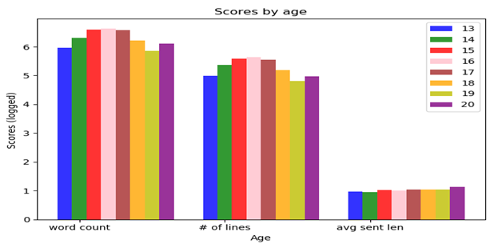

# reddit-age-predict

--- updating in process

#### Introduction:
The task of age classification and regression was already explored on different age ranges, but the question of age classification on teenagers can be more interesting and can be bring some insights on teenagers’ language acquisition and progress throughout the years. One of the main problems in this kind of exploration is the data – where can we find vast amount of tagged data of teenagers? 
In this project I used teenagers’ forum (surprisingly, named "Teenagers") – a Reddit.com’s subreddit. This subreddit (or similar) provided more than enough data that can also be used for further exploration, for example – tracking the language changes of a certain user over the years, discovering new language trends and slang and so on.

Note : Initial data collected in 2017...

#### Data collection
Reddit.com , with 542 million monthly visitors is ranked the 7th most visited website in the world is a is an American social news aggregation, web content rating, and discussion website. Posts are organized by subject into user-created boards called "subreddits", which cover a variety of topics. In general, except the sign-up date of a user, there is no additional information and the posts are almost anonymous. On some subreddits there’s an option to add a special tag near the username called flair, like country-tag in countries-related subreddit or **age flair** in r/Teenagers.

One setback of this flair is that the text inside is it static and not updating, for example a certain user can have the same age flair for several years since the updating is done manually.

Using PRAW and PushShift APIs I was able to pull huge amount of data from Reddit: 

First, the query was narrowed to get all the user names of users that posted or commented on r/Teenagers on 2017 only and also have flairs and signed up to Reddit on 2017. This query was meant to minimize the amount of false age labeling and still I got enough data.  Second, for every user on the list I pulled all his/her posts and comments from all around Reddit (not just from r/Teenagers). 
On r/Teenagers subreddit, there were 8 different age flairs from 13 to 19 and ‘OLD’ (for ages 20+).

| Age | # of sentences | # of words | avg. sent. length |
|-----|----------------|------------|-------------------|
| 13  | 99,788         | 921,794    | 9.23              |
| 14  | 233,085        | 2,061,241  | 8.84              |
| 15  | 378,080        | 3,906,477  | 10.33             |
| 16  | 436,929        | 4,329,352  | 9.9               |
| 17  | 357,003        | 3,859,352  | 10.81             |
| 18  | 153,171        | 1,668,043  | 10.89             |
| 19  | 63,529         | 708,217    | 11.14             |
| OLD | 94,283         | 1,272,507  | 13.49             |

The text was cleaned from URLs and full posts and although emoticons are not part a language I did leave them as they might help in a classification task.

#### Classification/Regression 
For each age, I applied NLTK’s tokenization tools and after shuffling I created batches in sizes of (about) 1500 words each (without breaking sentences) and the number of batches to use was set according to the lowest batch count among all ages. 
For a matter of comparison, I applied both SVM and Naïve Bayes along with the Linear Regression. (I also used KNN and sklearn's Decision Tree which gave less interesting results). Each Classifier/Regressor was used with 10-Fold Cross Validation.

#### Features
The feature vector for each batch consisted of 6 stylistic features:
Average sentences length, average word length, shell nouns count, reference words count, function words count and unique words count (all counting features were normalized). 
With the previous 6 features, a full bag of words was used to support with content.

|     | 13    | 14    | 15    | 16    | 17    | 18    | 19    | OLD   |
|-----|-------|-------|-------|-------|-------|-------|-------|-------|
| 13  | the   | the   | the   | the   | the   | I     | I     | the   |
| 14  | I     | I     | I     | I     | I     | the   | the   | to    |
| 15  | a     | a     | to    | to    | to    | to    | to    | a     |
| 16  | to    | to    | a     | a     | a     | a     | a     | and   |
| 17  | and   | and   | and   | and   | and   | and   | and   | I     |
| 18  | you   | you   | of    | you   | of    | of    | of    |       |
| 19  | of    | of    | you   | of    | you   | you   | you   | that  |
| OLD | is    | is    | is    | is    | is    | it    | it    | you   |

Table 2: Most frequent tokens (including reference and function words)

|     | 13     | 14    | 15   | 16    | 17     | 18     | 19    | OLD   |
|-----|--------|-------|------|-------|--------|--------|-------|-------|
| u   | like   | on    | so   | know  | because| up     | have  |
| like| this   | like  | me   | I’m   | do     | or     | just  |
| '🅱' | be    | with  | be   | as    | get    | at     | not   |
| get | me     | just  | do   | i     | at     | get    | this  |
| don’t| with  | this  | get  | your  | don’t  | would  | like  |
| know| just   | are   | they | at    | they   | what   | people|
| one | not    | so    | can  | about | about  | people | my    |
| would| your  | I’m   | all  | they  | people | can    | don’t |
| I’m | do     | as    | would| all   | it’s   | don’t  | your  |
| at  | out    | your  | really| really| because| do     | I’m   |
| they| an     | do    | an   | know  | all    | one    | think |
| all | it’s   | i     | up   | people| one    | from   | because|
| out | out    | don’t  | know | think| really | really | one   |
| not | The    | about  | good | an   | from   | about  | he    |

Table 3: Most interesting words among top50 frequent words (without order)

#### Results
Former and newer results will be updated here soon.
